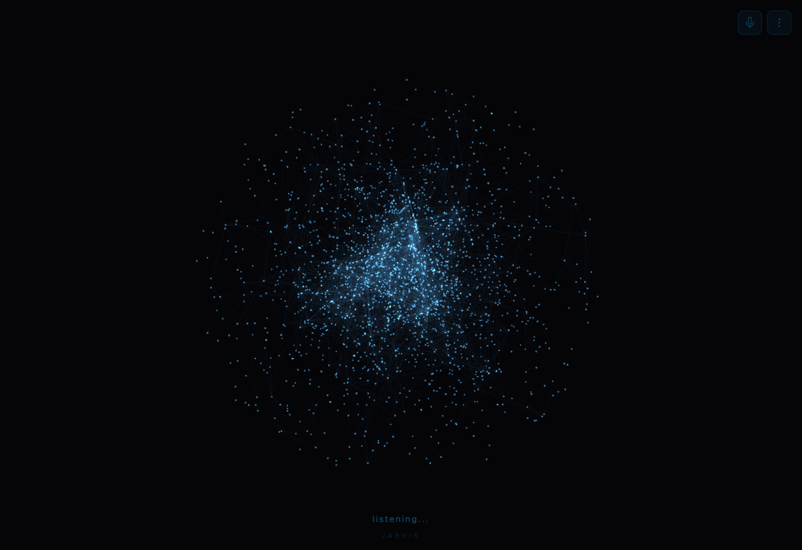

# D.O.B.B.Y — Desktop Operations Butler Built for You

**macOS 음성 + 손동작 AI 어시스턴트.**  
목소리로 Claude Code를 제어하고, 제스처로 macOS 데스크톱을 넘나듭니다. 손 하나로, 항상 켜져 있습니다.

> **macOS 전용** — Apple Silicon · Intel Mac 모두 지원. Linux/Windows 미지원.  
> English: [README.md](README.md)



---

## DOBBY란?

DOBBY는 Mac 화면 위에 항상 떠있는 투명 HUD 오버레이 형태의 개인 AI 어시스턴트입니다.

- **음성 명령** — "도비야"로 깨우고, 자연어로 말하면 음성으로 응답
- **손동작 제어** — MediaPipe 기반 제스처로 마우스·키보드·macOS Space 전환
- **Claude 연동** — Claude Haiku(즉각 응답) · Claude Opus(심층 리서치)
- **Claude Code 오케스트레이션** — 음성으로 프로젝트 열기, 프롬프트 전송, tmux 세션 관리
- **macOS 네이티브** — Calendar·Mail·Notes는 AppleScript; Space 전환은 yabai; OAuth 불필요

---

## 아키텍처

```
Motion HUD (Electron .app)
├── hud.html        — Three.js 오브 UI + MediaPipe 손동작 + STT/TTS
├── src/main.ts     — BrowserWindow (항상 맨 위, 모든 Space, 투명)
└── src/preload.ts  — contextBridge (electronAPI)
        │
        │  wss://localhost:8340/ws/voice   (음성 대화)
        │  wss://localhost:8340/ws/motion  (손동작 이벤트)
        ▼
FastAPI 백엔드 (server.py · port 8340)
├── LLM    : Claude Haiku (음성 응답) / Claude Opus (리서치)
├── TTS    : Qwen3 로컬 → Fish Audio → macOS say (폴백 체인)
├── STT    : faster-whisper (base, Korean, Silero VAD)
├── Actions: AppleScript · Claude Code CLI 서브프로세스
└── Memory : SQLite + FTS5
        │
        │  [ACTION:OPEN_CLAUDE] → claude -c (인터랙티브 TUI)
        │  [ACTION:TYPE_TO_CLAUDE] → 클립보드 붙여넣기 → Enter
        ▼
Terminal.app (프로젝트별 데스크톱)
└── claude -c --dangerously-skip-permissions
    (마지막 세션 자동 재개, 인터랙티브 Claude Code TUI)
```

---

## 기능

### 음성 인터페이스
- **웨이크워드** — "도비야"로 활성화 (10초 대기, 응답 후 자동 연장)
- **자연어 명령** — 웨이크워드 이후 자유로운 한국어 발화
- **Barge-in** — 도비가 말하는 중에 끼어들어 새 명령 전달
- **TTS 응답** — Qwen3(로컬) → Fish Audio → macOS `say` 폴백 체인
- **타입 모드** — 제스처로 활성화하는 음성 받아쓰기 (포커스된 앱에 직접 입력)

### 손동작 (오른손)
| 제스처 | 동작 |
|--------|------|
| 검지 포인팅 | 마우스 커서 이동 |
| 정지 유지 400ms (Dwell) | 왼쪽 클릭 |
| 1초 내 두 번 Dwell | 더블 클릭 |
| 왼쪽 스와이프 | 다음 macOS Space |
| 오른쪽 스와이프 | 이전 macOS Space |
| V-sign (✌️) 유지 | 타입 모드 활성화 |
| 엄지척 (👍) | 타입 모드 비활성화 |
| 주먹 → 펼치기 | Mission Control |

### 손동작 (왼손)
| 제스처 | 동작 |
|--------|------|
| 엄지척 (👍) | Enter |
| 엄지 내림 (👎) | 실행 취소 (Cmd+Z) |

### macOS 연동
- **Space 전환** — yabai 기반 정밀 이동 (`yabai -m space --focus N`)
- **프로젝트 매핑** — `config/desktops.yaml`로 Space 번호 ↔ 프로젝트 디렉토리 연결
- **Claude Code 세션** — 프로젝트별 tmux 세션 열기·재개·프롬프트 전송
- **캘린더** — 오늘 일정 및 예정 이벤트 조회
- **메일** — 최근 이메일 읽기 (읽기 전용)
- **노트** — Apple Notes 읽기·쓰기

### 메모리
- SQLite + FTS5 기반 장기 메모리 저장
- 대화 맥락과 관련된 내용을 자동으로 불러옴

---

## 요구사항

- **macOS 12 Monterey 이상** (AppleScript 의존)
- Python 3.11+
- Node.js 18+
- [Anthropic API 키](https://console.anthropic.com/)
- [Claude Code CLI](https://claude.ai/code) — `npm install -g @anthropic-ai/claude-code`
- [yabai](https://github.com/koekeishiya/yabai) — Space 전환용 (`brew install koekeishiya/formulae/yabai`)

선택사항:
- [Fish Audio API 키](https://fish.audio/) — 고품질 TTS (없으면 `say` 폴백)
- Qwen3 TTS 로컬 서버 — 가장 빠른 TTS (없으면 Fish Audio 폴백)

---

## 빠른 시작

### 1. 클론 및 설정

```bash
git clone https://github.com/ChangooLee/dobby.git
cd dobby

cp .env.example .env
# ANTHROPIC_API_KEY 등 필수 값 입력
```

### 2. Python 의존성

```bash
python -m venv .venv
.venv/bin/pip install -r requirements.txt
```

### 3. Motion HUD 빌드

```bash
cd motion-hud
npm install
npm run build      # TypeScript 컴파일
npm run pack       # DOBBY.app 패키지 (macOS arm64)
cd ..
```

### 4. SSL 인증서 (최초 1회)

```bash
openssl req -x509 -newkey rsa:2048 -keyout key.pem -out cert.pem \
  -days 365 -nodes -subj '/CN=localhost'
```

### 5. 데스크톱 설정

```bash
cp config/desktops.example.json config/desktops.yaml
# config/desktops.yaml 편집 — Space 번호를 내 프로젝트에 맞게 매핑
```

### 6. 실행

```bash
./start.sh   # TTS 서버 + 백엔드 + HUD 전체 시작
./stop.sh    # 전체 종료
```

### 로그 확인

```bash
tail -f /tmp/dobby_server.log   # 백엔드
tail -f /tmp/hud.log            # Motion HUD
tail -f /tmp/qwen3_tts.log      # TTS 서버
```

> 자세한 재시작·복구 절차는 **[RUNBOOK.md](RUNBOOK.md)** 참고

---

## 환경 변수

| 변수 | 필수 | 설명 |
|------|------|------|
| `ANTHROPIC_API_KEY` | ✅ | Claude API 키 (서버 + Claude Code CLI 공용) |
| `FISH_API_KEY` | — | Fish Audio TTS API 키 |
| `FISH_VOICE_ID` | — | Fish Audio 음성 모델 ID |
| `QWEN3_TTS_URL` | — | Qwen3 로컬 TTS 서버 URL |
| `USER_NAME` | — | 사용자 이름 (도비의 호칭에 사용) |
| `SAY_VOICE` | — | macOS say 폴백 음성 (기본: `Yuna`) |
| `MOTION_CONTROL_ENABLED` | — | 시작 시 모션 제어 활성화 여부 (`false`) |
| `CALENDAR_ACCOUNTS` | — | 캘린더 이메일 주소 (쉼표 구분) |

---

## 주요 파일

| 파일 | 역할 |
|------|------|
| `server.py` | FastAPI 백엔드 — WebSocket, LLM, 액션 디스패치 |
| `motion-hud/hud.html` | HUD 전체 UI — Three.js 오브 + 손동작 + 음성 |
| `motion-hud/src/main.ts` | Electron 메인 프로세스 |
| `actions.py` | 시스템 액션 (Terminal, Chrome, Claude Code) |
| `motion_actions.py` | 제스처 → 시스템 액션 핸들러 |
| `memory.py` | SQLite 장기 메모리 (FTS5 검색) |
| `desktop_manager.py` | macOS Space 전환 및 프로젝트 추적 |
| `calendar_access.py` | Apple Calendar 연동 (AppleScript) |
| `mail_access.py` | Apple Mail 연동 (읽기 전용) |
| `notes_access.py` | Apple Notes 연동 (읽기/쓰기) |
| `work_mode.py` | Claude Code 헤드리스 세션 관리 |
| `dispatch_registry.py` | 액션 태그 → 핸들러 라우팅 |
| `config/desktops.yaml` | Space 번호 ↔ 프로젝트 디렉토리 매핑 |
| `RUNBOOK.md` | 실행·재시작·종료 절차 |

---

## 액션 태그

LLM 응답에 삽입되어 시스템 동작을 트리거합니다:

| 태그 | 동작 |
|------|------|
| `[ACTION:OPEN_CLAUDE]` | 프로젝트 Space 전환 + `claude -c` 실행 |
| `[ACTION:TYPE_TO_CLAUDE]` | 활성 Claude Code 세션에 프롬프트 직접 입력 |
| `[ACTION:BUILD]` | 새 프로젝트 생성 + Claude Code 열기 |
| `[ACTION:BROWSE]` | Chrome에서 URL/검색 열기 |
| `[ACTION:RESEARCH]` | Claude Opus 심층 리서치 |
| `[ACTION:SETUP_DESKTOPS]` | 모든 Space 순회, 각 프로젝트에 Claude Code 열기 |
| `[ACTION:REMEMBER]` | 장기 메모리에 사실 저장 |
| `[ACTION:ADD_TASK]` | 태스크 추가 |

---

## macOS Space 관리

DOBBY는 **yabai**를 통해 macOS Space를 제어합니다.

### Space 전환 방식

`yabai -m space --focus N`으로 현재 위치와 관계없이 항상 정확한 Space로 이동합니다.

### Space 자동 배정

`config/desktops.yaml`에 등록된 프로젝트는 고정 Space를 사용합니다.  
미등록 프로젝트를 열 때는 DOBBY가 빈 Space를 자동으로 찾아 배정합니다.

### Space 생성 제약

macOS SIP가 활성 상태에서는 프로그램으로 새 Space를 생성할 수 없습니다.

**권장 방법**: Mission Control에서 Space를 프로젝트 수보다 여유있게 미리 생성  
```
F3 (Mission Control) → 상단 Space 바 → "+" 버튼
```

SIP 부분 비활성화가 필요한 경우 상세 절차는 README.md 참고.

---

## 로드맵

### 진행 중
- [ ] 짧은 발화 감지를 위한 VAD 임계값 안정화
- [ ] TTS 에코 피드백 루프 제거를 위한 에코 캔슬레이션 개선

### 예정
- [ ] **오프라인 웨이크워드** — Whisper 청크 방식을 경량 전용 모델(openWakeWord, Silero 등)로 교체, 100ms 미만 레이턴시 목표
- [ ] **스트리밍 STT** — 실시간 부분 전사로 체감 응답 지연 감소
- [ ] **화면 컨텍스트** — 주기적 스크린샷 → 멀티모달 Claude 프롬프트로 DOBBY가 화면을 "볼" 수 있게
- [ ] **플러그인 시스템** — `server.py` 수정 없이 로드 가능한 선언형 액션 정의
- [ ] **웹 검색** — Brave Search / Perplexity 연동으로 실시간 정보 조회
- [ ] **홈 자동화** — HomeKit / Home Assistant 음성 제어
- [ ] **다국어 지원** — 영어 웨이크워드 및 응답 지원
- [ ] **제스처 커스터마이징** — 설정 파일로 사용자 정의 제스처 바인딩
- [ ] **DMG 인스톨러** — 서명 및 공증된 macOS 배포 패키지
- [ ] **대화 히스토리 UI** — HUD 내 스크롤 가능한 트랜스크립트 패널

---

## 알려진 제약사항

- **macOS 전용** — AppleScript·yabai는 macOS 의존; Linux/Windows 포트 계획 없음
- **카메라·마이크 권한** — 최초 실행 시 시스템 환경설정 > 개인 정보 보호에서 DOBBY.app 허용 필요
- **MediaPipe CDN** — 손동작 추적 WASM 파일을 jsDelivr CDN에서 로드; 오프라인 환경은 로컬 호스팅 필요
- **Whisper 레이턴시** — 4초 청크당 STT 처리 시간 약 300–800ms; 실시간 아님
- **yabai + SIP** — 프로그램적 Space 생성에는 SIP 부분 비활성화 필요; Mission Control에서 미리 생성이 더 간단
- **TTS 음질** — Fish Audio 음성 품질은 모델마다 차이; `say` 폴백은 한국어 억양이 부자연스러울 수 있음

---

## 포트 및 로그

| 컴포넌트 | 포트 | 로그 경로 |
|----------|------|----------|
| FastAPI 백엔드 | 8340 | `/tmp/dobby_server.log` |
| Motion HUD (Electron) | — | `/tmp/hud.log` |
| Qwen3 TTS 서버 | 8000 | `/tmp/qwen3_tts.log` |

---

## 라이선스

MIT — [LICENSE](LICENSE) 참조

---

Powered by [Anthropic Claude](https://anthropic.com) · [MediaPipe](https://mediapipe.dev) · [Three.js](https://threejs.org) · [faster-whisper](https://github.com/SYSTRAN/faster-whisper)
